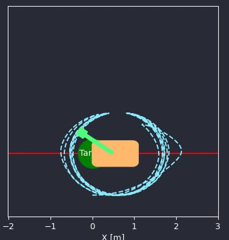

## Homework 1 Overview

The homework is designed for the "Advanced Control Methods-2024" course. It includes:

- Demonstrative code for the [inverted pendulum system](https://regelum.aidynamic.io/systems/inv_pendulum/), its modified version with friction, and various controllers.
- A set of [practical tasks](#practical-tasks) for students to implement.

The controllers, all featuring an energy-based component for swing-up, transition to a PD regulator after the pendulum reaches a critical angle. The homework features the following energy-based controllers:

- Basic version without friction compensation.
- Enhanced version with friction compensation.
- Advanced version with adaptive friction compensation.

These controllers can be found within the [`src/policy.py`](./src/policy.py).

This repo utilizes [regelum-control](https://regelum.aidynamic.io/systems/inv_pendulum/) Python package. 
This package is designed for researchers and practitioners in reinforcement learning and optimal control.

## Practical Tasks

Students are expected to complete the following assignments:

1. [Cartpole System Implementation](#task-1-cartpole-system-implementation-15-of-the-grade) - This task accounts for 15% of the homework grade.
2. [PD Controller Implementation](#task-2-tuning-the-pd-regulator-for-cartpole-35--of-the-grade) - This task accounts for 35% of the homework grade.
3. [Swing Up Controller Implementation](#task-3-derive-the-controller-for-cartpole-swingup-50-of-the-grade) - This task is paramount, making up 50% of the homework grade.

Detailed task descriptions are available in the [Homework 1 assignments](#howework-1-assignments) section.

## Table of contents
- [Getting started](#getting-started):  Instructions to launch the controllers on inverted pendulum system.
- [Hw1 structure](#hw1-structure): An overview of the hw1's organization.
- [Homework 1 assignments](#howework-1-assignments): Detailed descriptions of the homework assignments.


## Getting started

This section should be used in demo purposes, so you can get along how everything should work on the example of [inverted pendulum system](https://regelum.aidynamic.io/systems/inv_pendulum/). 
Study the code, try to understand the insights of how everything is implemented and works.

### Step 1: clone the repo and install requirements

Before installing the requirements, it is recommended to create a virtual environment for your project. And then run

```shell
git clone https://gitflic.ru/project/aidynamicaction/classedu2024-advctrl.git
cd homework/hw1
pip install -r requirements.txt
code .
```

### Step 2: Run PD Regulator

Execute the PD regulator using the following command in your terminal:

```shell
python run.py \
    policy=inv_pendulum_pd \
    initial_conditions=inv_pendulum \
    system=inv_pendulum \
    --interactive \
    --fps=10  
```    

But it doesn't work with default action bounds `[-3, 3]`.

To run the PD regulator with custom action bounds:


```shell
python run.py \
    policy=inv_pendulum_pd \
    initial_conditions=inv_pendulum \
    system=inv_pendulum \
    policy.action_min=-20 \
    policy.action_max=20 \
    --interactive \
    --fps=10
```  

### Step 3: Run Energy-Based Controller on the inverted pendulum without friction

To run the energy-based controller:

```shell
python run.py \
    policy=inv_pendulum_energy_based \
    initial_conditions=inv_pendulum \
    system=inv_pendulum \
    --interactive \
    --fps=10
```  

### Step 4: Run Energy-Based Controller on the inverted pendulum with friction

To run the energy-based controller:

```shell
python run.py \
    policy=inv_pendulum_energy_based \
    initial_conditions=inv_pendulum \
    system=inv_pendulum_with_friction \
    --interactive \
    --fps=10
```  

It doesn't work.

### Step 5: Run Energy-Based Controller on the inverted pendulum with friction

But this controller does work:

```shell
python run.py \
    policy=inv_pendulum_energy_based_friction_compensation \
    initial_conditions=inv_pendulum \
    system=inv_pendulum_with_friction \
    simulator.time_final=20 \
    --interactive \
    --fps=10
```  


### Step 6: Run Adaptive Controller on the inverted pendulum with friction


```shell
python run.py \
    policy=inv_pendulum_energy_based_friction_adaptive \
    initial_conditions=inv_pendulum \
    system=inv_pendulum_with_friction \
    simulator.time_final=25 \
    --interactive \
    --fps=10
```  

> **Note:**
>
> For the `--fps` parameter, you can select any suitable value to ensure a smooth experience (e.g., `--fps=2`, `--fps=10`, `--fps=20`, etc.).

## Hw1 structure

- [`run.py`](./run.py): The main executable script.
- [`src/`](./src/): Contains the source code of the hw1.
    - [`policy.py`](./src/policy.py): Implements the PD and energy-based policies for inverted pendulum and cartpole systems.
    - [`system.py`](./src/system.py): Implements the inverted pendulum system, the inverted pendulum system with friction and cartpole system.
- [`presets/`](./presets/): Houses configuration files.
    - [`common/`](./presets/common): General configurations.
        - [`common.yaml`](./presets/common/common.yaml): Settings for common variables (like sampling time)
    - [`policy/`](./presets/policy/): Policy-specific configurations.
        - [`inv_pendulum_pd.yaml`](./presets/policy/inv_pendulum_pd.yaml): Settings for the Proportional-Derivative (PD) regulator for inverted pendulum system.
        - [`inv_pendulum_energy_based.yaml`](./presets/policy/inv_pendulum_energy_based.yaml): Settings for the energy-based policy for inverted pendulum.
        - [`inv_pendulum_energy_based_friction_compensation.yaml`](./presets/policy/inv_pendulum_energy_based_friction_compensation.yaml): Settings for the energy-based policy with friction compensation for inverted pendulum.
        - [`inv_pendulum_energy_based_friction_adaptive.yaml`](./presets/policy/inv_pendulum_energy_based_friction_adaptive.yaml): Settings for the energy-based policy with adaptive friction coefficient.
        - [`cartpole_energy_based.yaml`](./presets/policy/cartpole_energy_based.yaml): Settings for the energy-based policy for cartpole system.
        - [`cartpole_pd.yaml`](./presets/policy/cartpole_pd.yaml): Settings for the Proportional-Derivative (PD) regulator for cartpole system
    - [`scenario/`](./presets/scenario/): Scenario configurations.
        - [`scenario.yaml`](./presets/scenario/scenario.yaml): Main orchestrator settings.
    - [`simulator/`](./presets/simulator/): Simulator configurations.
        - [`casadi.yaml`](./presets/simulator/casadi.yaml): Configurations for the [CasADi](https://web.casadi.org/) [RK](https://en.wikipedia.org/wiki/Runge%E2%80%93Kutta_methods) simulator.
    - [`system/`](./presets/system/): System specific configurations
        - [`cartpole.yaml`](./presets/system/cartpole.yaml): Configuration for cartpole system.
        - [`inv_pendulum_with_friction.yaml`](./presets/system/inv_pendulum_with_friction.yaml): Configuration for inverted pendulum system with friction.
        - [`inv_pendulum.yaml`](./presets/system/inv_pendulum.yaml): Configuration for inverted pendulum without friction.

## Homework 1 assignments

The following sections detail the assignments for Homework 1. 
Each task involves coding, which must be enclosed within designated markers. 
To ensure that your submission meets the requirements, adhere to the provided code structure and validate your solutions with the corresponding tests.

### Code Structure

Place your code between the following markers in the provided files:

```python
#########################
## YOUR CODE GOES HERE ##

...

## YOUR CODE ENDS HERE ##
#########################
```

### Assignment Validation

For each task, a test is available to verify its successful completion. A task is considered complete if and only if its corresponding test executes without any errors.


### Task 1: Cartpole System Implementation (15% of the grade)

You are to implement the cartpole system dynamics. The system's differential equations are provided in [notes.pdf](./notes.pdf)

Within [src/system.py](./src/system.py), locate the MyCartPole class and insert the correct expressions for the system's state derivatives:
```python
Dstate[0] = ... # derivative of \vartheta 
Dstate[1] = ... # derivative of x
Dstate[2] = ... # derivative of \omega
Dstate[3] = ... # derivative of v_x
```

Validate your implementation by running the test command:

```shell
pytest test.py::test_cartpole_system -v --disable-warnings  
```

Once the test passes, proceed to Task 2.

### Task 2: Tuning the PD regulator for Cartpole (35 % of the grade)

Determine the PD coefficients that will maintain the cartpole in a stationary upright position.

Find PD coefficients for cartpole hold problem. 
In [`src/policy.py`](./src/policy.py) find the `CartPolePD` class and update it with the appropriate PD coefficients.

Execute the following command to test the PD regulator setup:

```shell
python run.py policy=cartpole_pd initial_conditions=cartpole_hold system=cartpole --interactive --fps=10 
```

This should stabilize the cart at the origin (x = 0, x_dot = 0, omega = 0) with the pole upright (vartheta mod 2 pi = 0). Verify your solution with the provided test:

```shell
pytest test.py::test_cartpole_hold -v --disable-warnings 
```

### Task 3: Derive the controller for Cartpole Swingup (50% of the grade)

The goal is to design an energy-based controller to swing up the pole, and then position the cart at the origin. Upon the pole nearing the vertical position, you may opt to switch to the PD controller from Task 2, either with a smooth transition or an immediate shift.

Please consult exercises 1 and 2 in [notes.pdf](./notes.pdf) for a foundational understanding of energy-based controllers applied to the cartpole swing-up problem.

The expected behavior of a well-implemented and tuned energy-based controller for the cartpole swing-up is depicted here:



By observing the system's behavior, you can identify the appropriate time to switch from the energy-based controller to the PD regulator, which is typically when the pole angle becomes relatively small.

Once you are ready with inference find the `CartPoleEnergyBased` class in [src/policy.py](./src/policy.py) and update it with the appropriate code.

To initiate the swing-up procedure, use:

```shell
python run.py policy=cartpole_energy_based initial_conditions=cartpole_swingup system=cartpole --interactive --fps=10 
```

Assess your implementation with the following test:

```shell
pytest test.py::test_cartpole_swingup -v --disable-warnings 
```

## Submission Guide

Follow these simple steps to submit your homework:

1. Execute `bash prepare_for_submit.sh` in your terminal. You'll get a `src-hw1.tar.gz` file.
2. Visit our [Telegram bot](https://t.me/aida_att_bot).
3. Type `/submit_hw1` in the chat and upload your `src-hw1.tar.gz` file.
4. The bot will test your homework and provide a score.
5. Happy with your score? Upload `src-hw1.tar.gz` to the LMS for official grading.
6. Want to improve? Adjust your homework and resubmit with `/submit_hw1`.

That's it! Good luck with your homework! 