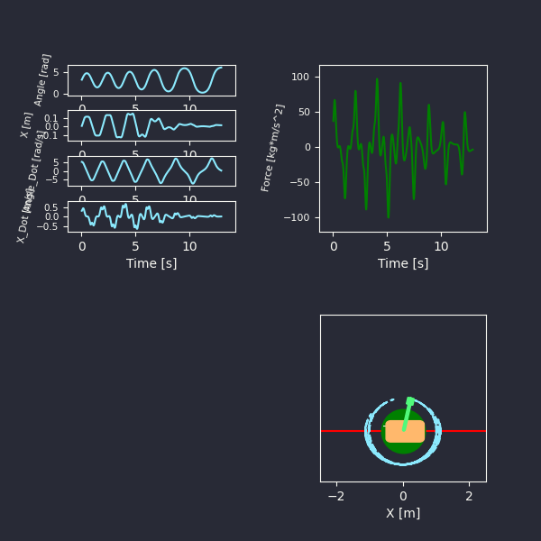

# Homework 2. Adaptive control.

The homework is designed for the "Advanced Control Methods-2024" course. It includes a set of practical tasks for students to implement.

## Homework 2 assignments

The following sections detail the assignments for Homework 2. 
Each task involves coding, which must be enclosed within designated markers. 
To ensure that your submission meets the requirements, adhere to the provided code structure and validate your solutions with the corresponding tests.

### Code Structure

Place your code between the following markers in the provided files:

```python
#########################
## YOUR CODE GOES HERE ##

...

## YOUR CODE ENDS HERE ##
#########################
```

### Assignment Validation

For each task, a test is available to verify its successful completion. A task is considered complete if and only if its corresponding test executes without any errors.


### Task 1: Implementation of the cartpole system with friction (15% of the grade)

You are to implement the cartpole system dynamics. The system's differential equations are provided in [notes.pdf](./notes.pdf)

Within [src/system.py](./src/system.py), locate the `CartPoleWithFriction` class and insert the correct expressions for the system's state derivatives:
```python
Dstate[0] = ... # derivative of \vartheta 
Dstate[1] = ... # derivative of x
Dstate[2] = ... # derivative of \omega
Dstate[3] = ... # derivative of v_x
```

Validate your implementation by running the test command:

```shell
pytest test.py::test_cartpole_system -v --disable-warnings  
```

Once the test passes, proceed to Task 2.

### Task 2: Tuning the PD regulator for Cartpole (35 % of the grade)

Determine the PD coefficients that will maintain the cartpole in a stationary upright position.

Find PD coefficients for cartpole hold problem. 
In [`src/policy.py`](./src/policy.py) find the `CartPolePD` class and update it with the appropriate PD coefficients.

Execute the following command to test the PD regulator setup:

```shell
python run.py policy=cartpole_pd initial_conditions=cartpole_hold system=cartpole_with_friction --interactive --fps=10 
```

This should stabilize the cart at the origin (x = 0, x_dot = 0, omega = 0) with the pole upright (vartheta mod 2 pi = 0). Verify your solution with the provided test:

```shell
pytest test.py::test_cartpole_hold -v --disable-warnings 
```

### Task 3: Derive the adaptive controller for Cartpole Swingup Problem (50% of the grade)

The goal is to design an energy-based adaptive controller to swing up the pole, and then position the cart at the origin. Upon the pole nearing the vertical position, you may opt to switch to the PD controller from Task 2, either with a smooth transition or an immediate shift.

Please consult exercises 1 and 2 in [notes.pdf](./notes.pdf) for a foundational understanding of energy-based adaptive controllers applied to the cartpole swing-up problem.

The expected behavior of a well-implemented and tuned energy-based adaptive controller is depicted here:



By observing the system's behavior, you can identify the appropriate time to switch from the energy-based controller to the PD regulator, which is typically when the pole angle becomes relatively small.

Once you are ready with inference find the `CartPoleEnergyBasedFrictionAdaptive` class in [src/policy.py](./src/policy.py) and update it with the appropriate code.

To initiate the swing-up procedure, use:

```shell
python run.py policy=cartpole_energy_based_friction_adaptive initial_conditions=cartpole_swingup system=cartpole_with_friction --interactive --fps=10
```

Assess your implementation with the following test:

```shell
pytest test.py::test_cartpole_swingup -v --disable-warnings 
```

## Submission Guide

Follow these simple steps to submit your homework:

1. Execute `bash prepare_for_submit.sh` in your terminal. You'll get a `src-hw2.tar.gz` file.
2. Visit our [Telegram bot](https://t.me/aida_att_bot).
3. Type `/submit_hw2` in the chat and upload your `src-hw2.tar.gz` file.
4. The bot will test your homework and provide a score.
5. Happy with your score? Upload `src-hw2.tar.gz` to the LMS for official grading.
6. Want to improve? Adjust your homework and resubmit with `/submit_hw2`.

That's it! Good luck with your homework! 

## Hw2 structure

- [`run.py`](./run.py): The main executable script.
- [`src/`](./src/): Contains the source code of the hw1.
    - [`policy.py`](./src/policy.py): Implements the PD and energy-based adaptive policies for cartpole system with friction.
    - [`system.py`](./src/system.py): Implements the cartpole system with friction.
- [`presets/`](./presets/): Houses configuration files.
    - [`common/`](./presets/common): General configurations.
        - [`common.yaml`](./presets/common/common.yaml): Settings for common variables (like sampling time)
    - [`policy/`](./presets/policy/): Policy-specific configurations.
        - [`cartpole_energy_based_friction_adaptive.yaml`](./presets/policy/cartpole_energy_based_friction_adaptive.yaml): Settings for the energy-based adaptive policy for cartpole system with friction.
        - [`cartpole_pd.yaml`](./presets/policy/cartpole_pd.yaml): Settings for the Proportional-Derivative (PD) regulator for cartpole system with friction.
    - [`scenario/`](./presets/scenario/): Scenario configurations.
        - [`scenario.yaml`](./presets/scenario/scenario.yaml): Main orchestrator settings.
    - [`simulator/`](./presets/simulator/): Simulator configurations.
        - [`casadi.yaml`](./presets/simulator/casadi.yaml): Configurations for the [CasADi](https://web.casadi.org/) [RK](https://en.wikipedia.org/wiki/Runge%E2%80%93Kutta_methods) simulator.
    - [`system/`](./presets/system/): System specific configurations
        - [`cartpole_with_friction.yaml`](./presets/system/cartpole_with_friction.yaml): Configuration for cartpole system with friction.